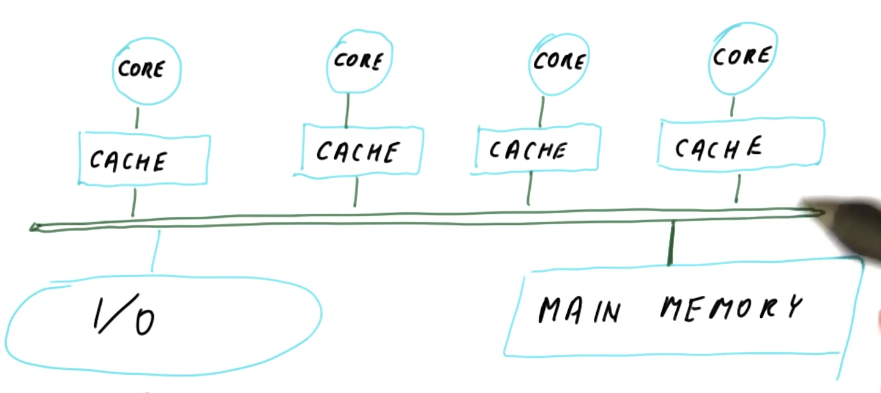
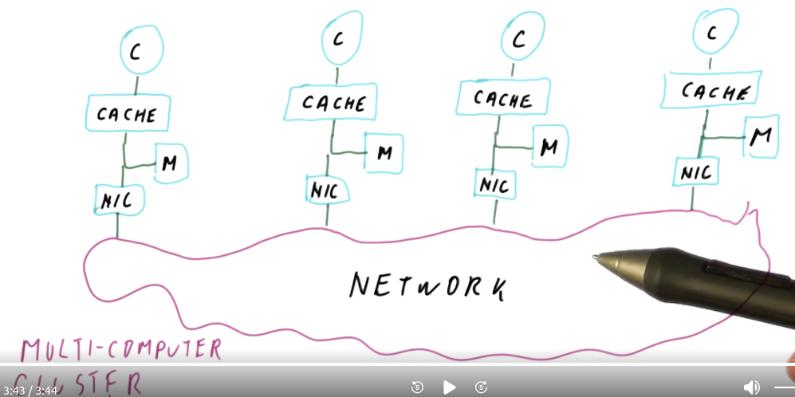
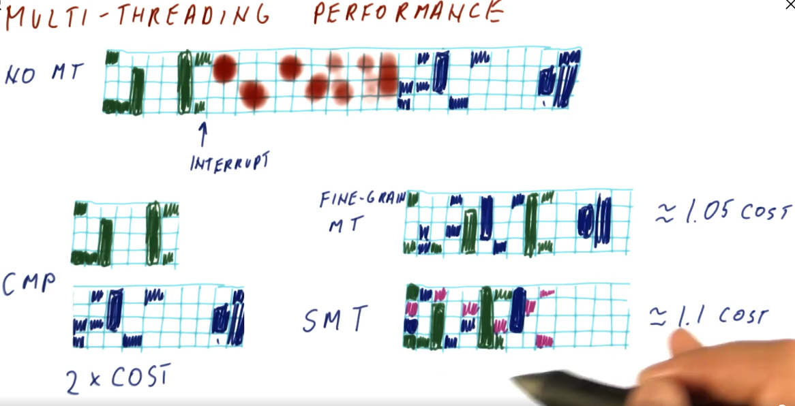
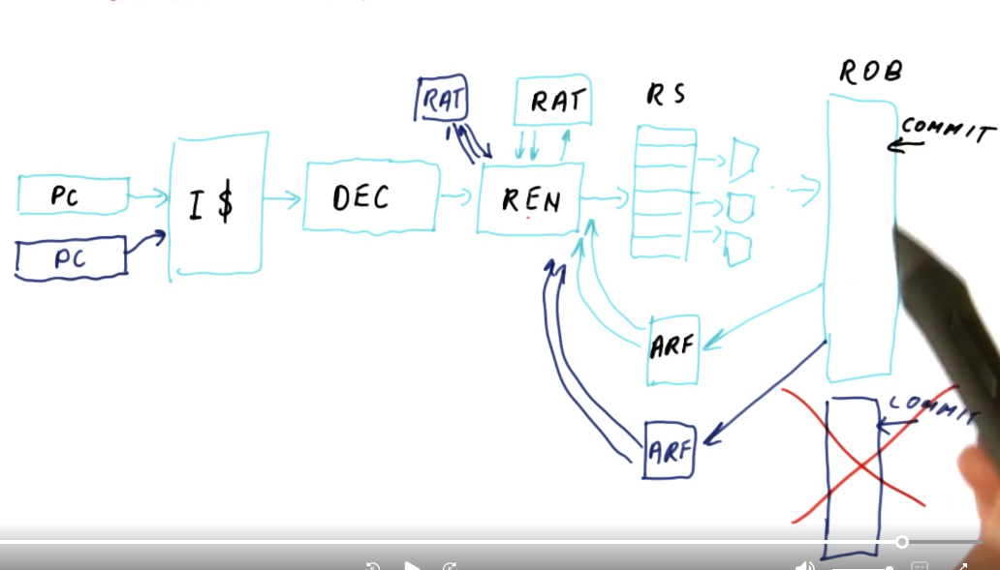

# Multi-Processing

## Flynn's Taxonomy of Parallel Machines

1. **SISD** - Single Instruction, Single Data - typical single core processor
2. **SIMD** - SIngle Instruction, Multiple Data - vector processor
3. **MISD** - Multiple Instruction, Single Data - stream processor, not used very often
4. **MIMD** - Multiple Instruction, Multiple Data - multi processor

## Why Multiprocessors?

- Uniprocessors are preferable, but are limited by the frequency and instruction width.

## Multiprocessor Needs Parallel Programs

- Disadvantages of Multiprocessors:
  - Parallel code is much harder to develop and debug
  - Performance Scaling is difficult to achieve

## Centralized Shared Memory

- UMA - Uniform Memory Access Time: All cores have caches, but share the main memory. Each core can share information by writing to the main memory. Also called Symmetric Multiprocessor (SMP).

## The Problems with Centralized Main Memory

- The problems are:
  - The Problems with Centralized Main Memory
  - Memory get too many accesses/second
  - Memory bandwidth contention
- Thus, Centralized Main Memory works only for small numbers of cores (<16)

## Distributed Shared Memory

- Non Uniform Memory Access (NUMA): Each core will have its own cache and a slice of the main memory.
- Advantages:
  - Each core will have fast access to its own slice of main memory.
  - The memory bandwidth scales with the number of cores more cores, more bandwidth.
- With NUMA the operating system should put the stack and data pages for core N in the memory slice associated with core N.

## Distributed Memory

- There is no sharing of memory, each core has its own cache, memory, and a network interface card. A network message must be used for communicating between cores.
- Also called multi computer or cluster computer.
- This structure forces the programmer to think about the communication between computers.

## A Message Passing Program

- With an array manipulation program, each core gets a portion of the array. The cores each work on their portion and send the result to one processor for compilation. Message passing requires that messages be acknowledged between cores.

## Shared Memory Program

- **The shared memory must be locked and unlocked so that only one core at a time can access a memory location**
- Barriers are required to make sure all the cores have completed their task before moving on to the next task.

## Message Passing vs Shared Memory

- Message Passing
  - Communication is done by the programmer
  - Data Distribution is done manually by the programmer
  - HW Support is simple
  - Program Correctness is difficult
  - Program Performance is difficult
- Shared Memory
  - Communication between cores is automatically part of the system
  - Data Distribution is automatically part of the system
  - HW Support is extensive
  - Programming Correctness is less difficult than message passing
  - Programming Performance is very difficult to achieve

## Shared Memory Hardware

- **Shared memory needs extensive hardware support**
- Types of shared memory:
  1. Multiple cores share the same physical address space
  2. Multi Threading by time sharing a core
  3. Hardware Multi threading with coarse grain threading, fine grain threading, or simultaneous multi threading

## Multi Threading Performance

- SMT: a core can execute multiple threads at the same time. (Also called hyper-threading)

## SMT Hardware Changes

- SMT is not much more expensive than a UMA or Fine Grained Multi threaded core.
- For an SMT machine:
  - Add a program counter
  - Add a RAT
  - Add architectural registers

## SMT, Data Cache, and TLB

- With a Virtually-Indexed Virtually-Tagged Cache (VIVT) machine SMT will lead to the wrong data being used
- **With a Virtually-Indexed Physically-Tagged (VIPT) cache and a Physically-Indexed Physically-Tagged (PIPT) machine, the TLB must know which thread belongs to which processor**

## SMT and Cache Performance

- The cache is shared by all the SMT threads.
  - This is good for fast data sharing
  - This is bad because cache capacity is shared by all threads, which can lead to cache thrashing.
