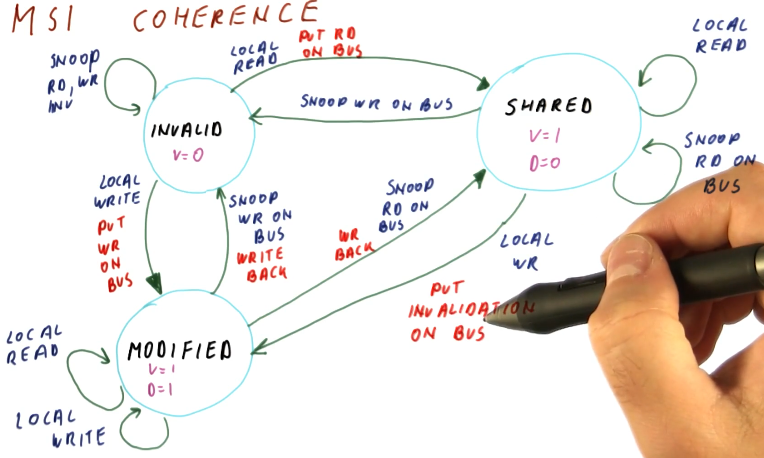
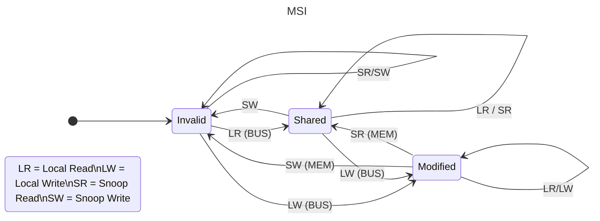
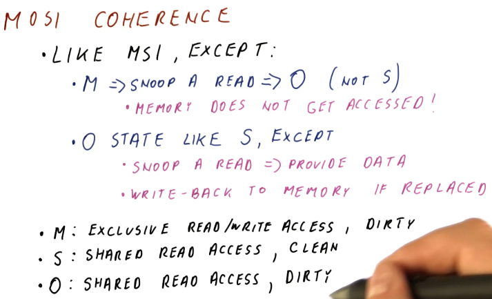
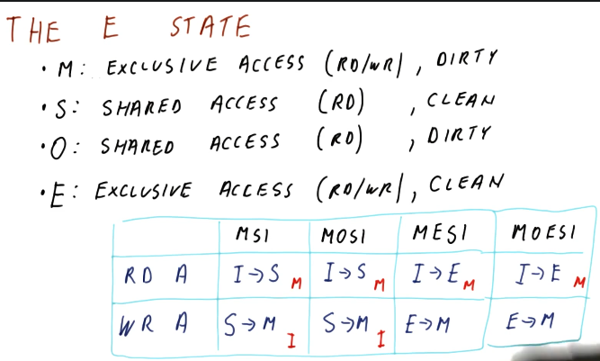
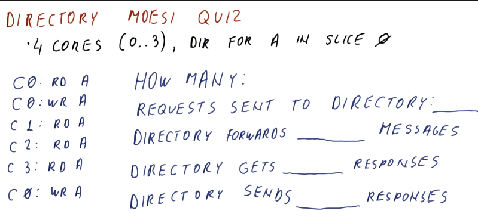

# Cache Coherence

Coherence is needed to ensure that when one core writes to its cache, other cores get to see it when they read it out of their own cache.

## Cache Coherence Problem

- The programmer expects to see shared memory. Since each core has its own cache, cache coherence can become a problem because each cache can have its own copy of the same memory location.
- **Incoherent** - each cache copy behaves as an individual copy, instead of as the same memory location.

## Coherence Definition

There are 3 requirements for coherence:

  1. Data read from a memory location by a core should match the last valid write
  2. Any write by a core to a memory location must reflect the same value when read by another core
  3. All cores should agree on the order of the writes to a memory location

## How to Get Coherence

- Options that don't work:
  1. Don’t do caches - The main memory will be coherent which leads to poor performance
  2. All cores share the same L1 cache - also poor performance.
  3. Use private write through caches - This is not coherent.

- **Force reads made to one cache to see the writes made in another**. This is essentially the first property of the coherence definition. We can achieve this via choosing one of the following options:
     1. Broadcast writes to update other caches. This is called **write-update coherence**
     2. Writes prevent other copies of the block from having hits. This is called **write-invalidate**
  - We also need to ensure the same order of writes is seen by all cores (property 3). We can achieve this via choosing one of the following options:
    1. Broadcast writes on a shared bus. This is called **snooping**
        
    2. Assign each block an "order point". This is called **directory based**

## Write Update Optimizations

There are two optimizations, the dirty and shared bit.

### Dirty Bit

- Memory throughput is a bottle-neck so we want to avoid unnecessary writes. To do this, a dirty bit is added to the cache for each block. When the data is written by a core, all other caches are updated. Dirty data is updated in memory when the block is replaced in the cache.
- The main benefits of the dirty bit is that both writes and reads to/from memory are reduced.

### Shared Bit

- The shared bit tells us whether the block is shared with others or not. Another line is added to the bus and when a read/write operation occurs, others snoop it and if they have the same block in the cache they pull the shared line to 1. The shared bit benefit is that if the block is not shared with anyone else we don't need to do a bus write.

## Write Invalidate Snooping Coherence

- A write invalidates other copies, potentially causing a cache miss for cores accessing the data. The newly written cache becomes the sole valid copy, responding to data requests. If a read occurs, a shared bit is set to 1, indicating multiple copies of the data.
- Disadvantage: there is a miss on all the readers when a core writes
- Advantage: if a core needs to update the same block two or more times, the reads and writes can be done locally after the first write.

## Update Vs. Invalidate Coherence

- If an application has a burst of write to one address, invalidate is the better method.
- If an application writes to different words in the same block, invalidate is the better method.
- If one core writes and another core reads often, update is the better method.
- All modern processors use the invalidate process, because it is better when a thread moves to another core.

## MSI Coherence

It is an invalidation protocol.

## Cache To Cache Transfers

- Cache to cache transfers occur when a cache (C1) owns the data (the block is in the ‘M’ state) and a read request for the data (C2) is detected on the bus. C1 must supply the data because it has the only valid copy of the data.
- The possible methods to do this are
  1. Abort and retry. The downside of this approach is there needs to be two memory latencies to get the data to the requester.
  2. Intervention. The core that owns the data intervenes and tells the memory it will respond. An intervention signal must be added to the bus. A downside of this approach is that the hardware is more complex.
- Modern processors use the Intervention method.

## Avoiding Memory Writes on Cache to Cache Transfers

- When using the Intervention method, the memory needs to be written when there is a read of modified data.
- **It would be better if the memory was only written when the block is kicked out the cache**. To do this we introduce an **owner** state. The owner is responsible for responding to read requests and updating memory. This avoids the inefficiency of the MSI protocol that had to do with the memory getting unnecessary access that could be satisfied with caches that already have the data.

## MOSI Coherence

- If in M and snoop read, move to O
  - Memory does not get accessed
- If in O state and snoop read, like S except
  - Provide data
  - Write-back to memory if replaced

## M(O)SI Inefficiency

- Has inefficiency with thread private data, or data that is only ever accessed by a single thread. Data read and then write is when this occurs.
- When going from a Shared state to a Modified state, the block must pass through the invalid state. To eliminate this step a new state is introduced, the **Exclusive** state.

## The E State

- The exclusive state is used when a core is the only core that has a clean copy of the data.
- When a block is in the ‘E’ state it can move to the ‘M’ state directly because no other core has a copy of the data.

## Directory Based Coherence

- There is a downside to snooping. Every request must be broadcast, which means there must be one bus. This leads to a bottleneck and snooping cannot be scaled to more than 16 processors.
- To eliminate the need to broadcast, while still observing the coherence requirements, a directory can be used.
- A directory is distributed across all cores, each core has its own ‘slice’ and each slice serves a set of blocks. The directory keeps track of which caches have the block, for valid states only.
- A directory entry has:
  - 1 dirty bit
  - 1 bit per cache signifying present or not present
    - E.g. An 8 core system there are 8 bits for signifying present/not present (because 8 separate caches)
- The directory communication requires an acknowledgement from the cores after a request.

## Cache Misses With Coherence

We add another C to the 3Cs:

1. Compulsory
2. Conflict
3. Capacity
4. Coherence

There are two types of coherence misses:

1. True Sharing - different cores access the same data
2. False Sharing - different cores are accessing different memory locations, but these memory locations are in the same block. From the standpoint of coherence, data in the same block are the same data.
