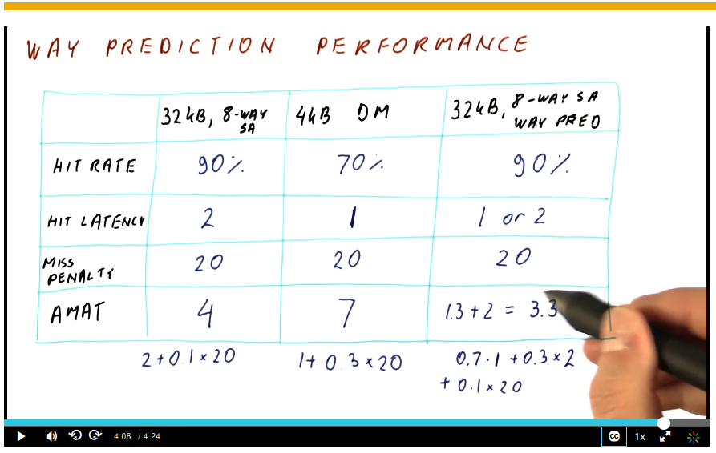

# Advanced Caches

## Improving Cache Performance

- There are three general categories of methods for improve cache performance all having to do with reducing the average memory access time.
  
$$  Average\ Memory\ Access\ Time\ (AMAT) = Hit\ Time + Miss\ Rate * Miss\ Penalty,\ where:$$

- The three ways of doing this are by reducing either the hit time, miss rate, or miss penalty.

### Reducing Hit Time

- Two simple methods of reducing the hit time (however they increase the miss rate) are:
  1. Reducing the cache size
  2. Reducing the cache associativity.
- Some more complex methods are:
  1. Overlapping the cache hit with another hit
  2. Overlapping the cache hit with a TLB hit
  3. Optimizing the lookup for the common case
  4. Maintaining the replacement state in the cache more quickly

#### Pipelined Caches

- One way of speeding up hit times is to overlap one hit with another and we can achieve this by pipelining the cache. If an access comes in cycle N and it's a hit, and then another access comes in cycles N+1 and it is also a hit, in a non-pipelined cache the second access has to wait.

$$ Hit\ Time =\ Actual\ Hit\ Time\ of\ Cache\ + Wait\ Time $$

- To pipeline a cache, partition the task into three stages
  1. Reading the index to find the set
  2. Determining the hits and beginning the data read
  3. Finishing the data read

  

#### TLB and Cache Hit

- Hit Time is affected by having to access the TLB before accessing the cache. A processor starts out with the virtual address. We use part of the virtual address to index into the TLB and find the frame number. We then combine that with the page offset and now that we have the physical address we can use it to access our cache and get the data from it. If the TLB takes 1 cycle and the cache takes 1 cycle, then we need 2 cycles to access the data.

- A cache that is accessed using a physical address is called a physically accessed cache, a physical cache, or a physically indexed - physically tagged cache (PIPT).
- The overall latency is the TLB latency and the cache latency.

#### Virtually Accessed Cache

- We can improve the overall hit latency of the cache by using a virtually accessed cache. The virtual address is what we use to access the cache and get the data. On a cache miss we use the virtual address to tell us what the physical address is so that we can bring data into our cache. On cache hits we can get the data without doing the TLB access at all. Thus, virtual has an advantage over physical because the overall hit time is just the cache hit time and we don't need to access the TLB on miss (thus saving energy). Also, we get the data without address translation on a cache hit.
- The TLB also contains the permissions that allow us to read/write/execute certain pages. So even though we don't need the physical address for the data, we need to access the TLB in order to get these permissions.
- The downside of the virtually addressed cache is the virtual address is process specific. So
the cache needs to be flushed with every context switch, leading to cache misses.
- A second downside would be aliasing leading to incorrect execution.

#### Virtually Indexed Physically Tagged (VIPT)

- Combines the advantages of both physical and virtual caches.
- Start with the virtual address. Partition into the offset, index, and tag.
  - Index is used by the cache
  - Tag is used get the frame number.
- The index bits come from the virtual address, the tag bits come from the physical address.
- Both the cache lookup and the translation are done at the same time. It can be done without having to flush the cache and without aliasing. There is no aliasing if all the index bits come from the page offset. The cache has to be small enough to do this.

$$ Cache\ size <= Associativity\ of\ the\ cache * Page\ Size \ \ \ where:$$

#### Real VIPT Caches

- Check the real values later

#### Associativity and Hit Time

- High associativity in a cache improves the miss rate, but makes the hit time worse.
- Direct mapped sacrifices the miss rate to improve hit time.

#### Way Prediction

- Set associative cache but we guess which line in the set is most likely to hit. This gives us similar access time to direct mapped if we guessed correctly. If wrong, the set has other lines and we do a normal associative check. **We can use way prediction in any cache that has more than one block in a set** (so direct map cannot use it).

  

#### Replacement Policy and Hit Time Interaction

- Random: nothing to update on cache hit (faster hits, but bad miss rate)
- Least-Recently-Used (LRU): Results in a lower miss rater but we need to update lots of counters on hits (slower hits).

#### Not-Most-Recently-Used (NMRU)

- Track which block in the set is the most recently used at any given time. When we need to replace something, pick the block that is not the most recently used (e.g. pick randomly among other blocks).
- For a 2-way associative cache, we need a 1 bit counter to track the MRU, 4-way we need 2-bit counter, etc.
- One disadvantage is that we don't truly know which block is the real least recently used.

#### Pseudo Least Recently Used (PLRU)

- Approximates LRU but doesn't exactly match. We keep one bit per line in a set.
- All of the bits start at 0. Every time a line is accessed we set its bit to 1. As long as there is at least one zero bit present we keep doing this. If we need to replace something, we pick amongst the blocks whose bits are 0.
- Eventually, if we have a lot of hits and all of the bits are about to be set to 1, we set the other bits to 0 and the current bit to 1.

### Reducing the Miss Rate

- We have seen that reducing the hit time reduces AMAT. Now we will examine how reducing the miss rate also reduces the miss rate.
- The causes of misses are the **3Cs**
- Techniques for reducing are:
  1. Larger cache blocks
  2. Pre-Fetching
  3. Loop Interchange

#### The Three Cs

  1. Compulsory Misses
    - They are compulsory because they must always occur (even in infinite cache) to bring data into the cache initially.
  2. Capacity Misses
    - Misses for blocks that were in the cache but that were evicted due to lack of room (would not occur in infinite sized cache).
  3. Conflict Misses
    -  When a block is evicted not due to lack of space, but because it had limited associativity. It is a miss that would not be a miss if the cache was fully associative and of the same size.
  
#### Larger Cache BLocks

- Reduces miss rate when spatial locality is good, but increases the miss rate when spatial locality is bad.
- Reduces all 3Cs.
- This is because more words are brought in on a miss. So subsequent accesses may find data in the cache they wouldn't have with smaller cache blocks.

#### Pre-Fetching

- Guess which blocks will be accessed soon and bring them into the cache ahead of time.
- If the guess is right we eliminate misses. Bad guesses cause cache pollution because it might bring in something that is never used (not only did we get 1 miss, we may have created future misses).
- One way of implementing is to add prefetch instructions and let the compiler / programmer decide what to pre-fetch. It's difficult to implement though.
- Another way to do it is via hardware prefetching where the HW tries to guess what will be accessed soon.
  - Stream buffer (sequential), stride pre-fetcher, and correlating pre-fetcher are all techniques used

#### Loop Interchange

- Loop interchange aims to rearrange the order of nested loops to optimize data locality, thus reducing cache misses and improving overall performance.
- Not always possible, the compiler must ensure the interchange and non-interchange loops are equivalent

### Reduce the Miss Penalty

- Techniques for reducing are:
  1. Overlap multiple misses. The processor exploits memory level parallelism in order to do this.
  2. Multi-Level Caches (Cache Hierarchy)

#### Miss Under Miss (MUM) Support in Caches

- MUM refers to a situation where one cache miss triggers another cache miss. This occurs when a cache miss for a particular memory access leads to the loading of a cache line into the cache, but subsequently, due to either the eviction policy or the cache's associativity, another cache line is evicted or replaced before it is used by the processor. As a result, the processor experiences a second cache miss while attempting to access the evicted line, causing a cascade of misses.
- We need to have a miss status handling register (MSHRs) which keep information about ongoing misses in order to address this. 16-32 MSHRs is ideal because memory latencies are relatively long.

#### Cache Hierarchies

$$ AMAT = L1_{Hit\ Time} + L1_{Miss\ Rate} * L1_{Miss\ Penalty} \ \ \ where:$$

$$ L1_{Miss\ Penalty} = L2_{Hit\ Time} + L2_{Miss\ Rate} * L2_{Miss\ Penalty} $$

$$ L2_{Miss\ Penalty} = L3_{Hit\ Time} + L3_{Miss\ Rate} * L3_{Miss\ Penalty}\ ...$$

- The last level cache (LLC) is the last cache in the hierarchy and its miss penalty is the main memory latency.
- Local hit rate is the hit rate that the level cache actually observes.

#### Global vs Local Hit Rate

- Global hit rate is 1 - global miss rate, and global miss rate = # of misses in this cache / # of all memory references
- Local hit rate = # of hits / # of accesses to this cache
- Misses per 1000 instructions (MPKI)

#### Inclusion Property

- If a block is in L1 Cache and:
  - May or may not be in L2
  - Has to also be in L2, its called inclusion
  - Cannot also be in L2, its called exclusion
