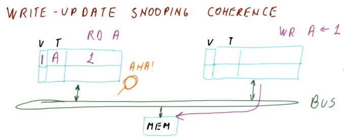

# Cache Coherence

Coherence is needed to ensure that when one core writes to its cache, other cores get to see it when they read it out of their own cache.

## Cache Coherence Problem

- The programmer expects to see shared memory. Since each core has its own cache, cache coherence can become a problem because each cache can have its own copy of the same memory location.
- **Incoherent** - each cache copy behaves as an individual copy, instead of as the same memory location.

## Coherence Definition

There are 3 requirements for coherence:

  1. Data read from a memory location by a core should match the last valid write
  2. Any write by a core to a memory location must reflect the same value when read by another core
  3. All cores should agree on the order of the writes to a memory location

## How to Get Coherence

- Options that don't work:
  1. Don’t do caches - The main memory will be coherent which leads to poor performance
  2. All cores share the same L1 cache - also poor performance.
  3. Use private write through caches - This is not coherent.

- **Force reads made to one cache to see the writes made in another**. This is essentially the first property of the coherence definition. We can achieve this via choosing one of the following options:
     1. Broadcast writes to update other caches. This is called **write-update coherence**
     2. Writes prevent other copies of the block from having hits. This is called **write-invalidate**
  - We also need to ensure the same order of writes is seen by all cores (property 3). We can achieve this via choosing one of the following options:
    1. Broadcast writes on a shared bus. This is called **snooping**
        
    2. Assign each block an "order point". This is called **directory based**

## Write Update Optimizations

There are two optimizations, the dirty and shared bit.

### Dirty Bit

- Memory throughput is a bottle-neck so we want to avoid unnecessary writes. To do this, a dirty bit is added to the cache for each block. When the data is written by a core, all other caches are updated. Dirty data is updated in memory when the block is replaced in the cache.
- The main benefits of the dirty bit is that both writes and reads to/from memory are reduced.

### Shared Bit

- The shared bit tells us whether the block is shared with others or not. Another line is added to the bus and when a read/write operation occurs, others snoop it and if they have the same block in the cache they pull the shared line to 1. The shared bit benefit is that if the block is not shared with anyone else we don't need to do a bus write.