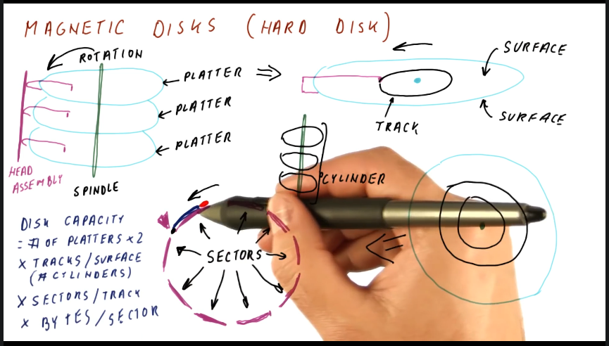

# Storage

- Storage keeps all of the files, programs, data, settings, and so on.
- Virtual memory is also implemented using storage because we cannot fit all of the data applications wants to access in physical memory.
- We care about performance (throughput and latency). Throughput is improving but not as quickly as the processor speed. Latency is improving but VERY slowly. Thus, processors are getting faster and faster but memory is falling further behind.
- In addition to performance, we are very concerned with reliability. If our disk fails, we lose all of our data so it is VERY important to have a very high reliability.
- The types of storage we can use consist of:
  - Magnetic disks
  - optical disks
  - Tape
  - Flash

## Magnetic Disks (Hard Drive)

- Magnetic disks are attached to a spindle. Data bits are on both side of the disk surfaces. Reference the picture below for more details.

  

$$
    Disk_{capacity} = 2 * Platters * \frac{Tracks}{Surface} * \frac{Sectors}{Track} * \frac{Bytes}{Sector}
$$

## Access Times for Magnetic Disks

- The latency to do 1 disk access consists of:
  - Seek Time - The time it takes to move the head assembly to the correct cylinder
  - Rotational Latency - How long we need to wait for the start of our sector to get under the head
  - Data Read - How long it takes to read until the end of the sector by head
  - Controller Time
  - I/O Bus Time
  - Plus a queuing delay to wait for previous accesses to finish
- Accesses to the disk happen one at a time.

## Trends for Magnetic Disks

- Capacity is improving
- Seek Time has slowly improved
- Rotation Speed has improved
- Controller and Bus Speed have improved
- Thus, disk access time is dominated by seek time.

## Optical Disks

- Similar to a hard disk in that it has a platter that rotates and we store bits on the surface of the disk. We shoot a laser to the surface and the reflection tells us if we have a 0 or a 1. Smudges / Dust is not as much of an issue. Often they are in the form of CDs or DVDs. Since they are portable, they need to be standardized, which slows improvement.

## Magnetic Tape

- Magnetic tape is used for secondary (backup) storage.
- They have a large capacity and are replaceable, but must be read sequentially.
- Slowly dying out (cheaper to use disks).

## Using RAM for Storage

- RAM is benefitting from Moore’s Law.
- SSD = Solid State Disk
- SSD can be a DRAM and Battery, it is fast, but expensive.
- Flash Memory uses transistors and is low power.

## Flash Storage

- Benefits from Moore's Law
- Consumes very little power
- Very fast because no moving parts (though slower than DRAM)
- Smaller capacity than disks
- Keeps data alive without power

## Hybrid Magnetic Flash

- A combination of magnetic disk and flash drive. **The flash drive is used as a cache for the disk**.
- Very cheap per GB
- Huge capacity
- Power Hungry
- Slow due to mechanical movement
- Sensitive to impact while spinning (fall from dropping).

## Connecting IO Devices

- I/O devices are connected to the system with a standardized bus.
- The buses must be standardized to connect to a number of IO devices, so improvement to the bus are slow.
- We typically have a hierarchy of buses. PCI Express for example is for very fast connections. SATA usually for storage. USB is slower than both byt can be used for many devices and its standard does not change as often.
